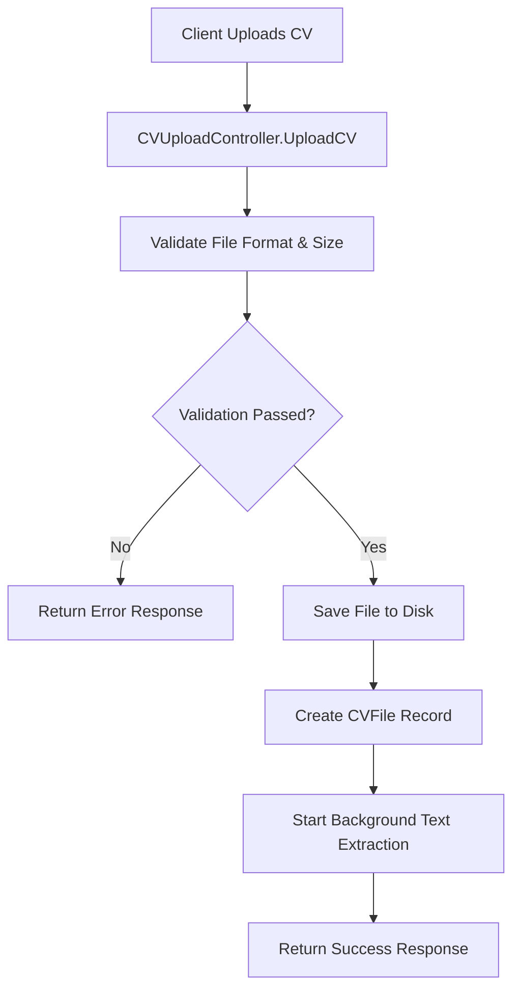
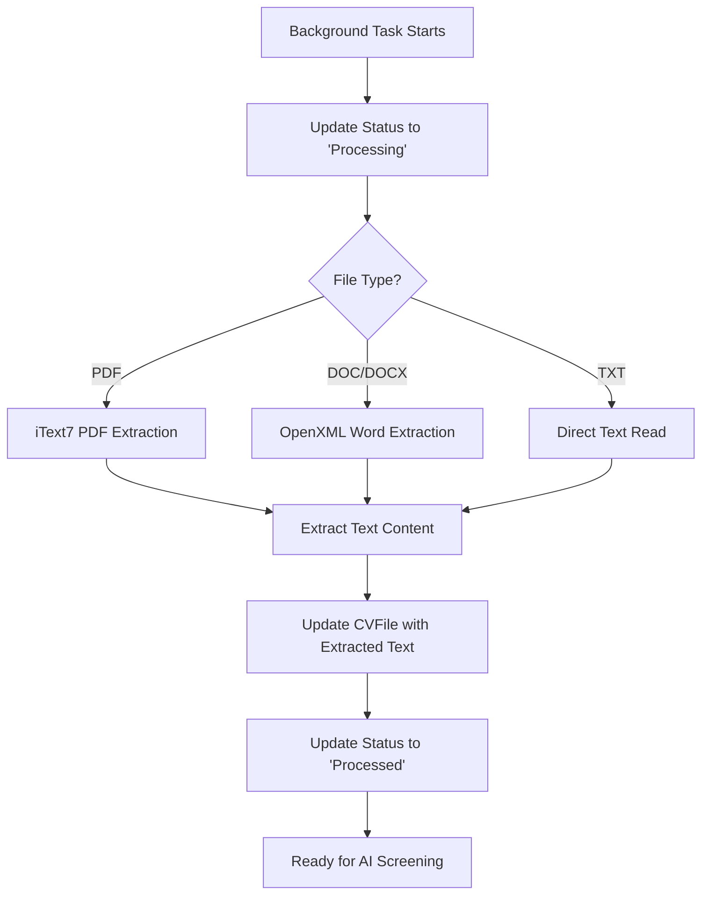
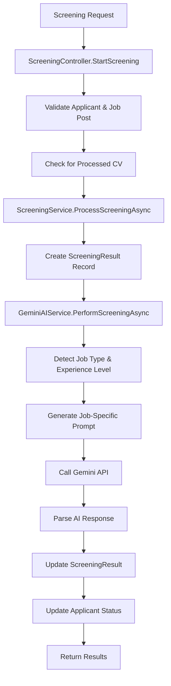

# CV Upload and AI Screening Flow Analysis

## Overview

This document provides a comprehensive analysis of the CV upload and AI screening process in the SmartCVFilter backend system, including the flow architecture, prompt engineering techniques, and recommendations for improving screening quality.

## System Architecture

### Core Components

1. **CVUploadService** - Handles file upload, validation, and text extraction
2. **GeminiAIService** - Manages AI-powered CV analysis using Google's Gemini API
3. **ScreeningService** - Coordinates the screening process and result storage
4. **AIPromptTemplates** - Contains sophisticated prompt templates for different job types
5. **Controllers** - API endpoints for CV upload and screening operations

## CV Processing Flow

### 1. File Upload Process



**Key Steps:**

- File validation (PDF, DOC, DOCX, TXT, max 10MB)
- Secure file storage with GUID-based naming
- Database record creation with "Uploaded" status
- Asynchronous text extraction initiation

### 2. Text Extraction Process



**Supported Formats:**

- **PDF**: Using iText7 library for robust text extraction
- **Word Documents**: Using DocumentFormat.OpenXml for .doc/.docx files
- **Text Files**: Direct file reading for .txt files

### 3. AI Screening Process



## AI Prompt Engineering Analysis

### Current Prompt Structure

The system uses a sophisticated multi-layered prompt approach:

#### 1. Base Prompt Template

```
You are an expert HR recruiter and technical interviewer with 15+ years of experience in talent acquisition.
Your task is to analyze a candidate's CV against a specific job posting and provide a comprehensive, objective assessment.

ANALYSIS GUIDELINES:
1. Be objective and fair in your assessment
2. Focus on relevant skills, experience, and qualifications
3. Consider both technical and soft skills
4. Look for growth potential and cultural fit indicators
5. Identify any red flags or concerns
6. Provide actionable insights for hiring decisions
```

#### 2. Job-Specific Prompts

The system dynamically generates job-specific analysis criteria for 10 different job types:

- **Software Development**: Technical skills, programming languages, frameworks, project portfolio
- **Marketing**: Digital marketing, analytics, campaign management, brand management
- **Sales**: Revenue generation, client relationships, business development
- **Finance**: Accounting, financial analysis, compliance, CPA qualifications
- **HR**: Talent acquisition, employee relations, policy development
- **Design**: UI/UX, graphic design, creative portfolio, design tools
- **Data Science**: Analytics, machine learning, statistics, data visualization
- **Management**: Leadership, strategic planning, team management
- **Operations**: Process improvement, supply chain, quality control
- **Customer Service**: Communication, problem-solving, CRM systems

#### 3. Experience Level Guidance

Different analysis criteria based on experience levels:

- **Entry Level**: Focus on education, internships, potential, learning ability
- **Mid Level**: Balance of experience and skills, career progression
- **Senior Level**: Leadership experience, complex problem-solving, mentoring
- **Lead Level**: Team leadership, strategic thinking, technical expertise
- **Executive Level**: Strategic vision, organizational impact, industry knowledge

#### 4. Scoring System

**Weighted Scoring Criteria:**

- Technical/Functional Skills: 30%
- Relevant Experience: 25%
- Education/Certifications: 15%
- Soft Skills/Communication: 15%
- Cultural Fit/Potential: 10%
- Career Progression/Growth: 5%

**Score Ranges:**

- 90-100: Exceptional match - exceeds requirements
- 80-89: Strong match - meets most requirements
- 70-79: Good match - meets basic requirements
- 60-69: Fair match - some gaps
- 50-59: Weak match - significant gaps
- Below 50: Poor match - does not meet requirements

### 5. Response Format

The AI is instructed to return structured JSON with:

- Overall Score (0-100)
- Summary (2-3 sentences)
- Strengths (array of strings)
- Weaknesses (array of strings)
- Detailed Analysis (3-4 paragraphs)
- Skill Match breakdown
- Experience Assessment
- Recommendation (Hire/Interview/Reject)
- Interview Questions

## Current Implementation Strengths

### 1. Robust File Processing

- Multi-format support (PDF, DOC, DOCX, TXT)
- Asynchronous processing to avoid blocking
- Comprehensive error handling
- File validation and security measures

### 2. Sophisticated AI Integration

- Job type detection from job descriptions
- Experience level detection
- Dynamic prompt generation
- Fallback to mock analysis when API fails

### 3. Comprehensive Data Model

- Detailed CV file tracking
- Rich screening result storage
- Status management throughout the process
- Audit trail with timestamps

### 4. API Design

- RESTful endpoints
- Proper error handling
- Authorization and security
- Clear response formats

## Areas for Improvement

### 1. Prompt Engineering Enhancements

#### A. Context-Aware Prompting

```markdown
Current: Generic job type detection
Improved: Industry-specific context analysis

- Add company size considerations
- Include industry-specific terminology
- Consider geographic location factors
- Add cultural fit indicators
```

#### B. Multi-Stage Analysis

```markdown
Current: Single-pass analysis
Improved: Multi-stage evaluation

1. Initial screening (quick pass/fail)
2. Detailed technical assessment
3. Soft skills evaluation
4. Cultural fit analysis
5. Final recommendation synthesis
```

#### C. Dynamic Prompt Adaptation

```markdown
Current: Static prompt templates
Improved: Adaptive prompting based on:

- CV complexity and length
- Job posting specificity
- Historical screening patterns
- Industry benchmarks
```

### 2. Enhanced Scoring Methodology

#### A. Weighted Scoring Refinement

```markdown
Current: Fixed weight distribution
Improved: Dynamic weighting based on:

- Job criticality levels
- Market demand for skills
- Company priorities
- Role-specific requirements
```

#### B. Comparative Analysis

```markdown
Add: Relative scoring against:

- Other candidates for the same position
- Industry benchmarks
- Historical successful hires
- Market standards
```

### 3. Advanced AI Techniques

#### A. Few-Shot Learning

```markdown
Implement: Example-based learning

- Provide examples of good/bad CVs
- Show successful hire patterns
- Include company-specific preferences
- Add industry-specific success cases
```

#### B. Chain-of-Thought Prompting

```markdown
Current: Direct analysis
Improved: Step-by-step reasoning

1. "First, I will analyze the technical skills..."
2. "Next, I will evaluate the experience relevance..."
3. "Then, I will assess the cultural fit..."
4. "Finally, I will synthesize my findings..."
```

#### C. Self-Reflection and Validation

```markdown
Add: Self-validation prompts

- "Are there any biases in my analysis?"
- "What additional information would help?"
- "How confident am I in this assessment?"
- "What are the potential risks of this hire?"
```

### 4. Quality Assurance Improvements

#### A. Consistency Checks

```markdown
Implement: Cross-validation mechanisms

- Multiple AI model comparison
- Human reviewer spot checks
- Historical accuracy tracking
- Bias detection algorithms
```

#### B. Feedback Loop Integration

```markdown
Add: Learning from outcomes

- Track actual hire performance
- Update scoring based on results
- Refine prompts based on feedback
- A/B test different approaches
```

### 5. Enhanced Data Processing

#### A. CV Preprocessing

```markdown
Current: Basic text extraction
Improved: Advanced preprocessing

- Section identification (education, experience, skills)
- Skill extraction and normalization
- Experience duration calculation
- Achievement quantification
```

#### B. Structured Data Extraction

```markdown
Add: Entity extraction for:

- Contact information
- Education history
- Work experience timeline
- Skills and certifications
- Achievements and metrics
```

## Recommended Implementation Roadmap

### Phase 1: Prompt Enhancement (Immediate)

1. Implement chain-of-thought prompting
2. Add self-reflection validation
3. Enhance job type detection accuracy
4. Improve experience level assessment

### Phase 2: Scoring Refinement (Short-term)

1. Implement dynamic weighting
2. Add comparative analysis
3. Include market context
4. Enhance recommendation reasoning

### Phase 3: Advanced AI Integration (Medium-term)

1. Implement few-shot learning
2. Add multi-model validation
3. Create feedback loop system
4. Develop bias detection

### Phase 4: Data Enhancement (Long-term)

1. Advanced CV preprocessing
2. Structured data extraction
3. Historical pattern analysis
4. Predictive modeling

## Technical Implementation Examples

### Enhanced Prompt Template

```csharp
public static string GetEnhancedPromptTemplate(string jobType, string experienceLevel,
    string jobDescription, string requiredSkills, string companyContext)
{
    return $@"
You are an expert HR recruiter with 15+ years of experience. Analyze this CV step-by-step.

ANALYSIS APPROACH:
1. First, identify the candidate's core competencies
2. Next, evaluate relevance to the specific role
3. Then, assess cultural and team fit
4. Finally, provide a comprehensive recommendation

JOB CONTEXT:
- Company: {companyContext}
- Role: {jobType} - {experienceLevel}
- Description: {jobDescription}
- Required Skills: {requiredSkills}

ANALYSIS STEPS:
Step 1: Technical Skills Assessment
- Identify technical competencies mentioned
- Rate proficiency level (Beginner/Intermediate/Advanced/Expert)
- Note any gaps in required skills

Step 2: Experience Relevance
- Analyze work history relevance
- Calculate years of relevant experience
- Identify career progression patterns

Step 3: Soft Skills Evaluation
- Communication abilities
- Leadership potential
- Problem-solving approach
- Adaptability indicators

Step 4: Cultural Fit Assessment
- Values alignment indicators
- Team collaboration evidence
- Growth mindset signs
- Potential red flags

Step 5: Final Recommendation
- Overall score (0-100) with detailed breakdown
- Hire/Interview/Reject recommendation
- Specific reasoning
- Interview focus areas
- Onboarding considerations

Please provide your analysis in the following JSON format:
{{
    ""step1_technical_skills"": {{
        ""identified_skills"": [""skill1"", ""skill2""],
        ""proficiency_levels"": {{""skill1"": ""Advanced"", ""skill2"": ""Intermediate""}},
        ""skill_gaps"": [""missing_skill1"", ""missing_skill2""],
        ""technical_score"": 85
    }},
    ""step2_experience"": {{
        ""relevant_years"": 5,
        ""career_progression"": ""Strong"",
        ""industry_experience"": ""Relevant"",
        ""experience_score"": 80
    }},
    ""step3_soft_skills"": {{
        ""communication"": ""Strong"",
        ""leadership"": ""Developing"",
        ""problem_solving"": ""Excellent"",
        ""soft_skills_score"": 75
    }},
    ""step4_cultural_fit"": {{
        ""values_alignment"": ""Good"",
        ""team_collaboration"": ""Strong"",
        ""growth_mindset"": ""Evident"",
        ""red_flags"": [],
        ""cultural_fit_score"": 85
    }},
    ""step5_recommendation"": {{
        ""overall_score"": 82,
        ""recommendation"": ""Interview"",
        ""reasoning"": ""Strong technical skills and relevant experience, but needs assessment of leadership potential"",
        ""interview_focus"": [""Leadership experience"", ""Team management"", ""Strategic thinking""],
        ""onboarding_considerations"": [""Mentorship program"", ""Leadership training"", ""Technical deep-dive""]
    }}
}}";
}
```

### Enhanced Scoring Algorithm

```csharp
public class EnhancedScoringService
{
    public ScreeningScore CalculateEnhancedScore(ScreeningAnalysisResult analysis,
        JobPost jobPost, CompanyContext companyContext)
    {
        var weights = CalculateDynamicWeights(jobPost, companyContext);

        var technicalScore = CalculateTechnicalScore(analysis, jobPost, weights.TechnicalWeight);
        var experienceScore = CalculateExperienceScore(analysis, jobPost, weights.ExperienceWeight);
        var softSkillsScore = CalculateSoftSkillsScore(analysis, weights.SoftSkillsWeight);
        var culturalFitScore = CalculateCulturalFitScore(analysis, companyContext, weights.CulturalWeight);

        var overallScore = (technicalScore + experienceScore + softSkillsScore + culturalFitScore) / 4;

        return new ScreeningScore
        {
            OverallScore = overallScore,
            TechnicalScore = technicalScore,
            ExperienceScore = experienceScore,
            SoftSkillsScore = softSkillsScore,
            CulturalFitScore = culturalFitScore,
            ConfidenceLevel = CalculateConfidenceLevel(analysis),
            Recommendation = GenerateRecommendation(overallScore, analysis),
            RiskFactors = IdentifyRiskFactors(analysis),
            Strengths = analysis.Strengths,
            Weaknesses = analysis.Weaknesses
        };
    }

    private ScoringWeights CalculateDynamicWeights(JobPost jobPost, CompanyContext context)
    {
        // Dynamic weighting based on job requirements and company needs
        var weights = new ScoringWeights();

        if (jobPost.IsTechnicalRole)
        {
            weights.TechnicalWeight = 0.4f;
            weights.ExperienceWeight = 0.3f;
        }
        else if (jobPost.IsLeadershipRole)
        {
            weights.SoftSkillsWeight = 0.4f;
            weights.CulturalWeight = 0.3f;
        }

        return weights;
    }
}
```

## Conclusion

The current CV upload and AI screening system provides a solid foundation with robust file processing, sophisticated prompt engineering, and comprehensive data management. The recommended improvements focus on enhancing prompt quality, implementing advanced AI techniques, and creating a feedback loop for continuous improvement. These enhancements will significantly improve screening accuracy, reduce bias, and provide more actionable insights for hiring decisions.

The phased implementation approach ensures that improvements can be rolled out incrementally while maintaining system stability and allowing for continuous learning and adaptation based on real-world performance data.
